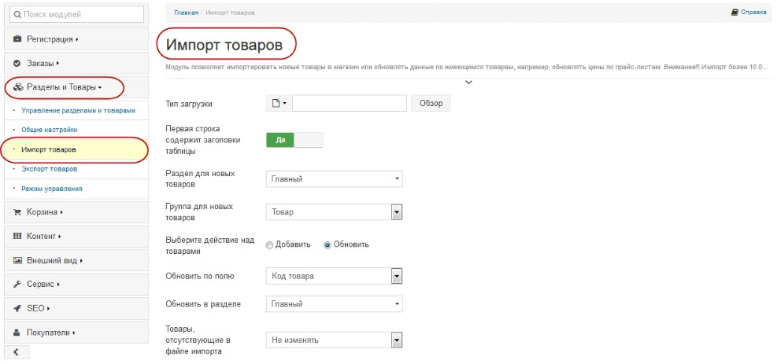

# Требования к проекту
---

# Содержание
1 [Введение](#intro)  
1.1 [Назначение](#appointment)  
1.2 [Бизнес-требования](#business_requirements)  
1.2.1 [Исходные данные](#initial_data)  
1.2.2 [Возможности бизнеса](#business_opportunities)  
2 [Требования пользователя](#user_requirements)  
2.1 [Программные интерфейсы](#software_interfaces)  
2.2 [Интерфейс пользователя](#user_interface)  
2.3 [Характеристики пользователей](#user_specifications)  
2.4 [Предположения и зависимости](#assumptions_and_dependencies)  
3 [Системные требования](#system_requirements)  
3.1 [Функциональные требования](#functional_requirements)  
3.2 [Нефункциональные требования](#non-functional_requirements)  
3.2.1 [Атрибуты качества](#quality_attributes)  
3.2.2 [Требования к безопасности](#security_requirements)  

<a name="intro"/>

# 1 Введение

Целью проекта является разработка автоматизированной системы «Интернет магазин бытовой техники».

<a name="appointment"/>

## 1.1 Назначение

Целью проекта является разработка автоматизированной системы «Интернет магазин бытовой техники». Предполагается, что использовать данную систему будут покупатели имеющие доступ в интернет.
Поход по магазинам может отнимать большое количество времени и дополнительных затрат на дорогу, при этом нет гарантий, что приехав в магазин покупатель сразу найдет подходящий товар.
Автоматизированная система обслуживанию клиентов позволит сэкономить время на поиски нужного товара, а также оставить или прочитать отзывы на товары и самое главное не выходя из дома оформить доставку до подъезда.
Кроме того, хранение информации о клиентах позволяет в дальнейшем накапливать скидку на товары и услуги магазина.

<a name="business_requirements"/>

## 1.2 Бизнес-требования

<a name="initial_data"/>

### 1.2.1 Исходные данные
Внедрение интернет-магазина позволит сократить время поиска необходимого товара, проводить анализ зависимости стоимости и качества продуктов. Использование системы обслуживания клиентов позволяет сократить время покупателей и круглосуточно принимать заказы параллельно с деятельностью магазина. Это привлекает больше покупателей и повышает эффективность работы магазина.

<a name="business_opportunities"/>

### 1.2.2 Возможности бизнеса
Внедрение интернет-магазина позволит сократить время поиска необходимого товара, проводить анализ зависимости стоимости и качества продуктов. Использование системы обслуживания клиентов позволяет сократить время покупателей и круглосуточно принимать заказы параллельно с деятельностью магазина. Это привлекает больше покупателей и повышает эффективность работы магазина.

<a name="user_requirements"/>

# 2 Требования пользователя

<a name="software_interfaces"/>

## 2.1 Программные интерфейсы
При разработке программного продукта используются:
- система управления базами данных (СУБД) – MySQL;
- языки программирования – PHP, HTML, JavaScript, CSS;
- CASE - средство – Rational Rose.
Интерфейс интернет-магазина должен быть простым и интуитивно понятным для пользователей. Все функциональные кнопки, выполненные в виде иконок должны содержать текстовое описание, отображаемое в виде всплывающей подсказки.

<a name="user_interface"/>

## 2.2 Интерфейс пользователя
Проект разрабатывается как автоматизированной системы «Интернет магазин бытовой техники». Предполагается, что использовать данную систему будут покупатели имеющие доступ в интернет 
 

 

 

<a name="user_specifications"/>

## 2.3 Характеристики пользователей
Многие люди желают иметь возможность заказывать товары удаленно, а так же предварительно изучить информацию о товаре, это позволит получать максимальную информацию о товаре и делать заказы, обладая минимальой технической грамотностью. Подобное приложение позволит им тратить меньше времени на совершение покупок. Интерфейс, спроектированный с учётом всех особенностей и дополнение подробной информацией о товаре позволят увеличить количество людей, совершающих покупки через интернет-магазин.

<a name="assumptions_and_dependencies"/>

## 2.4 Предположения и зависимости
1.	Приложение не работает при отсутствии подключения к Интернету;

<a name="system_requirements"/>

# 3 Системные требования
Информационная автоматизированная система может работать под управлением семейства операционных систем Win32 (Windows 95, Windows 98, Windows 2000, Windows NT и т.д.) с установленным сервером Apache.

<a name="functional_requirements"/>

## 3.1 Функциональные требования
Система должна обеспечивать возможность выполнения следующих функций:
Требования к функциональным характеристикам
Система должна обеспечивать возможность выполнения следующих функций:
- авторизация пользователей;
- инициализацию системы (ввод списков покупателей, перечней товаров в соответствии с торговыми планами);
- ввод и коррекцию текущей информации о выполнении обработки заказа;
- удаление информации о покупателях по истечению года с момента последней покупки в магазине;
- получение сведений о текущем состоянии товаров на складе.
 Исходные данные:
- выбранная покупателем модель изделия;
- наличие товара на складе;
- текущие сведения о возможности доставки товара.
Результаты:
- запись покупателя в базу данных;
- оформленный договор о покупке товара;
- оплата товара;
- заказ товара у поставщиков при его отсутствии на складе;
- доставка товара.

<a name="non-functional_requirements"/>

## 3.2 Нефункциональные требования
Приложение должно иметь дружественный дизайн;
навигация по приложению должна быть простой: у пользователя не должно возникать проблем с поиском и выбором товара;

<a name="quality_attributes"/>

### 3.2.1 АТРИБУТЫ КАЧЕСТВА
Быстрая скорость совершения заказа.

<a name="security_requirements"/>

### 3.2.2 Требования к безопасности
Надежное функционирование автоматизированной системы должно быть обеспечено выполнением организационно-технических мероприятий, таких как:
- использование лицензионного программного обеспечения;
- организация бесперебойного питания путем использования блоков бесперебойного питания;
- обеспечение минимального времени восстановления после отказа.
Загрузка и отображение основного окна программы не должны превышать 5 секунд.
